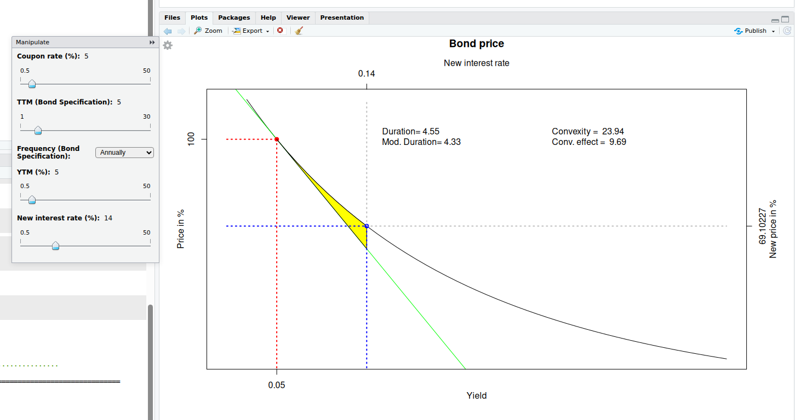

# Bond price sensitivity

This repo offers an interactive way for studying the bond price sensitivity as a function of:

- coupon rate
- time-to-maturity (TTM)
- yield

In case you do not want to install anything just visit the [interactive plot](https://krenar.shinyapps.io/bonds/).

# Requirements

This code is tested to run correctly with

- R version 4.5.1 (2025-06-13) -- "Great Square Root"
- RStudio Version 1.2.1335 RStudio 2025.09.0+387 "Cucumberleaf Sunflower" Release (af5fc22a687c0f462ee27c6afeeee38ee46507b9, 2025-09-11) for Ubuntu Jammy
  Older versions could also work.

Two packages are direct dependencies when you want to try the code locally:

- `manipulate` - for interactive plot
- `testthat` - in case you want to run the Unit Tests

The latest R version can be downloaded from [here](https://www.r-project.org/), while the latest RStudio from [here](https://posit.co/download/rstudio-desktop/).

# How to use

Command

```r
source("~/bonds/interactive_bonds.R") # adjust the path as needed
```

in RStudio console, or open `interactive_bonds.R` in RStudio and press `Source` button. After this you should generate the interactive plot like this:



The example is completly theoretical as it assumes that at time when when the bond with coupon rate `c` (and selected TTM and coupon frequency) is issued, we select the required Yield. If the yield matches the coupon rate the price matches the face value (expresed as percentage) and there is no risk. However, if some new interest rate is applied ( see x-axes on top), we can observe the new theoretical price (in second y- axis). In addition the script calculates the Macaulay’s duration, modified duration, convexity and convexity effect.
